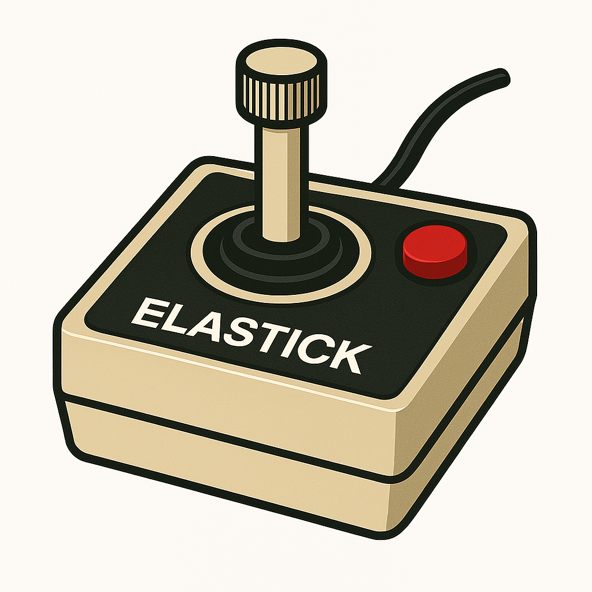
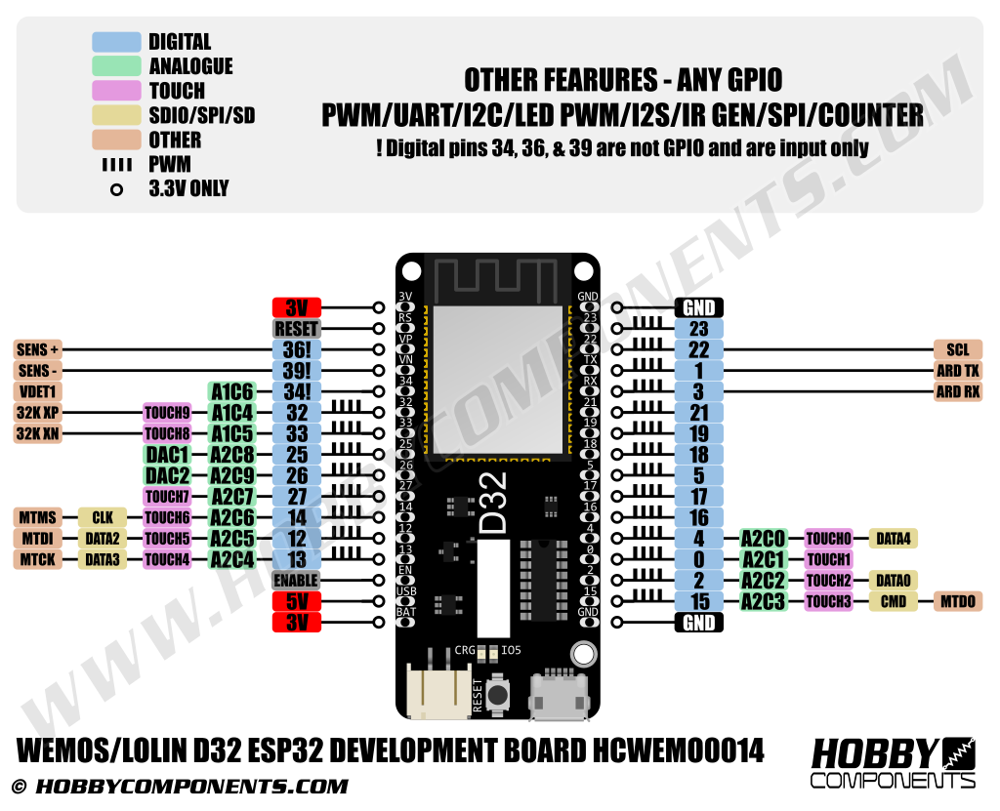

# Elastick adapter

Connect vintage joysticks (Apple 2, Atari, CoCo...) to your modern PC via Bluetooth.

🚧 WORK IN PROGRESS – NOT READY YET 🚧

Elastick is a hardware and software project using the ESP32-based Lolin D32 to interface with classic joysticks. These devices are detected as Bluetooth input peripherals and can be used with emulators like MAME or any other compatible game or application.

## Arduino IDE Setup

This URL must be added to the "Additional Boards Manager URLs" (in Files / Preferences) : https://dl.espressif.com/dl/package_esp32_index.json

Some dependencies must be added:

- ESP32-BLE-Gamepad (with NimBLE-Arduino dependency)
- Adafruit SSD1306
- U8g2 by Oliver (for screen)

## Hardware

- Lolin D32 (ESP32)
- OLED 0,96" SSD1306 I2C 128X64 pixels

## Lolin-D32 Pinout

## Additional documentation

- [Controllers pinout](/resources/controllers_pinout.md)

- 
