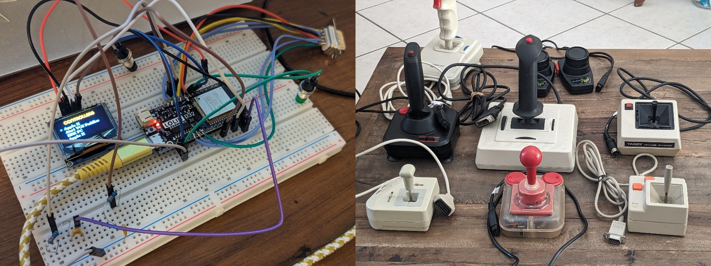

# Elastick adapter

Connect vintage joysticks (Apple II, Atari, CoCo, Sega…) to a modern PC via Bluetooth.

🚧 WORK IN PROGRESS – NOT READY YET 🚧

Elastick is a hardware and software project built around the ESP32‑based Lolin D32.

It interfaces with classic joysticks and exposes them as standard Bluetooth game controllers, compatible with emulators like MAME or with any modern game supporting gamepads.

Vintage controllers can also be tested directly on the Elastick device itself, without needing a Bluetooth connection.

## Supported Controllers

- Amstrad CPC
- Apple II
- Atari 8 bits / ST
- Atari 2600 Paddles
- Commodore 64/128/Amiga
- IBM PC (DA-15 connector)
- MSX
- Sega Master System
- Sega Mega Drive
- Tandy Color Computer (CoCo)
- Thomson MO/TO

## Folders

- **code**: arduino code (I used arduino IDE v2)
- **3d**: resources for 3D printing
- **elec**: kicad project for PCB
- **resources**: various pictures

## Known issues

#### Rotary button reliability
The rotary button does not behave consistently.

It is still unclear whether this is caused by a hardware limitation of the original controller or by a software issue in the current implementation. Further investigation is needed to determine whether this can be fixed in code.

#### ESP32 reboot during Bluetooth initialization

Some ESP32 boards (including the Lolin D32) may reboot exactly when Bluetooth is initialized.

This issue is **not** caused by power supply limitations or current spikes.

After investigation, the root cause was a **regression in the ESP32 Arduino core (version 3.x)** affecting BLE initialization.

With this version, the board consistently reboots as soon as Bluetooth is started, regardless of capacitors or external power.

Using the **ESP32 Arduino core 2.0.17** (or any stable 2.0.x release) restores full stability:

- no reboot during BLE initialization
- stable operation on USB power or on battery

**Recommendation:**

Install and use **ESP32 Arduino core 2.0.17** for this project. Avoid core **3.x**, which currently causes BLE crashes and reboots.

## Arduino IDE Setup

This URL must be added to the "Additional Boards Manager URLs" (in Files / Preferences) : https://dl.espressif.com/dl/package_esp32_index.json

Some dependencies must be added:

- ESP32-BLE-Gamepad (with NimBLE-Arduino dependency)
- U8g2 by Oliver (for screen)

## Hardware

- [Lolin D32 WROOM (ESP32) µc](https://fr.aliexpress.com/item/1005006233798203.html)
- [OLED 0,96" SSD1306 I2C 128X64 pixels](https://fr.aliexpress.com/item/1005004355547926.html)
- [DE-9 female connector](https://fr.aliexpress.com/item/1005006997365476.html) aka DB9
- [Rotary Button EC11](https://fr.aliexpress.com/item/1005007737001031.html)
- [USB-C connector](https://fr.aliexpress.com/item/1005008400775423.html) (not mandatory)

## Additional documentation

- [Controllers pinout](/resources/controllers_pinout.md)
