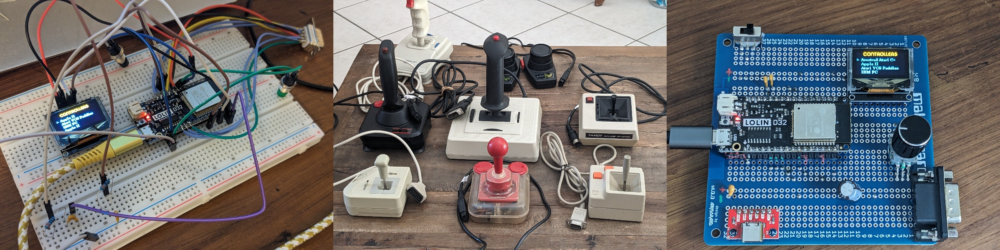

# Elastick adapter

Connect vintage joysticks (Apple II, Atari, CoCo, Sega…) to a modern PC via Bluetooth.

🚧 WORK IN PROGRESS – NOT READY YET 🚧

Elastick is a hardware and software project built around the ESP32‑based Lolin D32.

It interfaces with classic joysticks and exposes them as standard Bluetooth game controllers, compatible with emulators like MAME or with any modern game supporting gamepads.

Vintage controllers can also be tested directly on the Elastick device itself, without needing a Bluetooth connection.

## Supported Controllers

**Josticks / Game Pads**

- Amstrad CPC
- Apple II - with a cable adapter
- Atari 8 bits / ST
- Commodore 64/128/Amiga
- IBM PC (DA-15 connector) - with a cable adapter
- MSX
- Sega Master System
- Sega Mega Drive
- Tandy Color Computer (CoCo) - with a cable adapter
- Thomson MO/TO - with a cable adapter

**Mouses**

- Amiga Mouse (test only)
- Atari ST Mouse (test only)

**Paddles**

- Atari 2600 Paddles

## Installation

The main code is located in the code/elastick folder. The project now works with **VSCode IDE + PlatformIO** extension. Simply open this folder from the PlatformIO extension, build and upload on the Elastick board!

The main folders:

- **code**: arduino code
- **3d**: resources for 3D printing (not ready yet)
- **elec**: kicad project for PCB
- **resources**: various pictures

## Known issues

#### Devices requiring 5V power

Most devices work without using the VCC pin at all, but a few peripherals need a full 5‑volt supply to operate correctly. Since the Arduino only provides 3.3 V, these devices may fail to initialize or behave unpredictably.
So far, only one mouse has shown this limitation; all other tested devices function normally.

#### ESP32 reboot during Bluetooth initialization

Some ESP32 boards (including the Lolin D32) may reboot exactly when Bluetooth is initialized.

After investigation, the root cause was a **regression in the ESP32 Arduino core (version 3.x)** affecting BLE initialization. The board consistently reboots as soon as Bluetooth is started. Using the **ESP32 Arduino core 2.0.17** restores full stability:

- no reboot during BLE initialization
- stable operation on USB power or on battery

Using ESP32 Arduino core 2.0.17 fully resolves this issue.

## Hardware

- [Lolin D32 WROOM (ESP32) µc](https://fr.aliexpress.com/item/1005006233798203.html)
- [OLED 0,96" SSD1306 I2C 128X64 pixels](https://fr.aliexpress.com/item/1005004355547926.html)
- [DE-9 female connector](https://fr.aliexpress.com/item/1005006997365476.html) aka DB9
- [Rotary Button EC11](https://fr.aliexpress.com/item/1005007737001031.html)

## Additional documentation

- [Controllers pinout](/resources/controllers_pinout.md)
