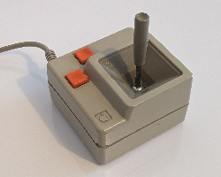
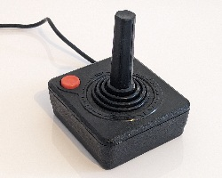
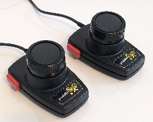
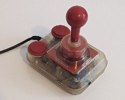
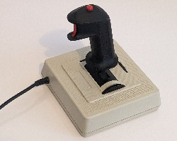
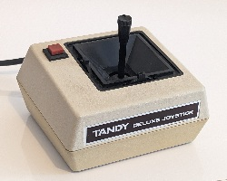

# Controllers pinouts

All connector diagrams in this document show the **male plug as viewed from the outside** (i.e., the side you see when looking directly at the pins).

Pinout diagrams are limited to the signals supported by the Elastick adapter: primary directional inputs and 2 buttons.

## Amstrad CPC Joystick

**DE-9 connector**

1. Up

2. Down

3. Left

4. Right

5. -

6. Button 2

7. Button 1

8. GND

9. -

## Apple 2 Joystick

This joystick uses 150 KΩ variable resistors connected to VCC for the analog axis.

DE-9 connector | Apple Joystick A2M2002
:-------------:|:---------------------:
 | 

1. Button 1

2. VCC (+5V)

3. GND

4. -

5. X-Axis (analog)

6. -

7. Button 2

8. Y-Axis (analog)

9. -

## Atari 2600 Joystick

DE-9 connector | Atari CX-10 Joystick
:-------------:|:-------------------:
 | 

1. Up

2. Down

3. Left

4. Right

5. -

6. Button 1

7. VCC (+5V)

8. GND

9. -

## Atari 2600 Paddles

The 2 paddles use 1 MΩ variable resistors for the analog axis.

DE-9 connector | Atari CX-30 Paddles
:-------------:|:------------------:
 | 

1. -

2. -

3. Button 2

4. Button 1

5. Paddle 1 (analog)

6. -

7. VCC (+5V)

8. GND

9. Paddle 2 (analog)

## Atari ST / Commodore 64 / Amiga Joystick

DE-9 connector | Competition Pro
:-------------:|:--------------:
 | 

1. Up

2. Down

3. Left

4. Right

5. -

6. Button 1

7. VCC (+5V)

8. GND

9. Button 2

## IBM PC Joystick

DA-15 connector | CH Products FlightStick
:--------------:|:-----------------------
 | 

1. VCC (+5V)

2. Button 1

3. X-Axis (analog)

4. GND

5. -

6. Y-Axis (analog)

7. Button 2

8. -

9. -

10. -

11. -

12. -

13. -

14. -

15. -

## Tandy Color 'CoCo' Computer Joystick

DIN-6 connector | Tandy Deluxe Joystick
:--------------:|:--------------------:
 | 

1. X-Axis (analog)

2. Y-Axis (analog)

3. GND

4. Button 1

5. VCC (+5V)

6. Button 2
